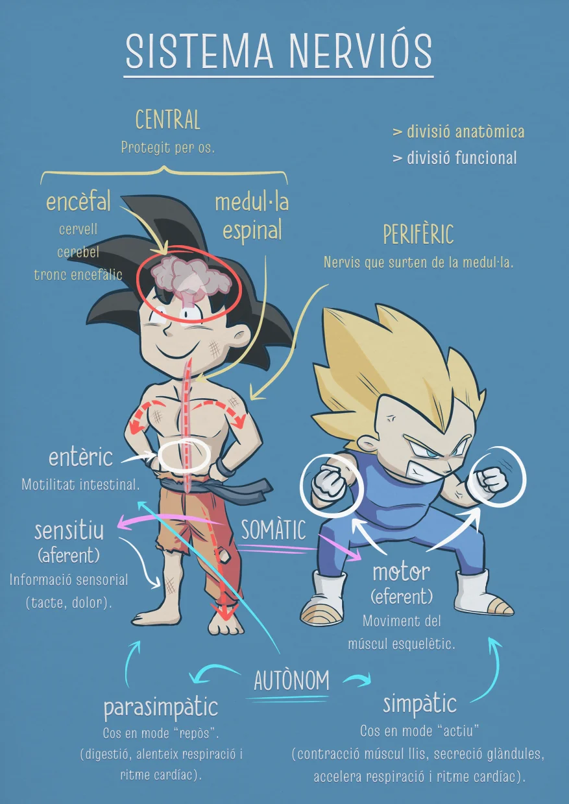

El sistema nervioso se clasifica por ubicación y por función.

### División anatómica

- **Central**: Protegido por hueso, se divide en **médula espinal** y **encéfalo** (cerebro, cerebelo, tallo encefálico).

- **Periférico**: Nervios que salen de la médula.

### División funcional

#### Somático
Acciones voluntarias, se subdivide en:

  - **Sensitivo o aferente:** Información sensorial (tacto, dolor), los impulsos eléctricos viajan hacia el cerebro.
  - **Motor o eferente:** Movimiento del músculo esquelético, los impulsos eléctricos viajan desde el cerebro.

#### Autónomo
Acciones involuntarias, se subdivide en:

  - **Simpático:** Cuerpo en modo "activo" (contracción músculo liso, secreción glándulas, acelera respiración y ritmo cardíaco).
  - **Parasimpático:** Cuerpo en modo "reposo" (digestión, ralentiza respiración y ritmo cardíaco).
  - **Entérico:** Motilidad intestinal.

